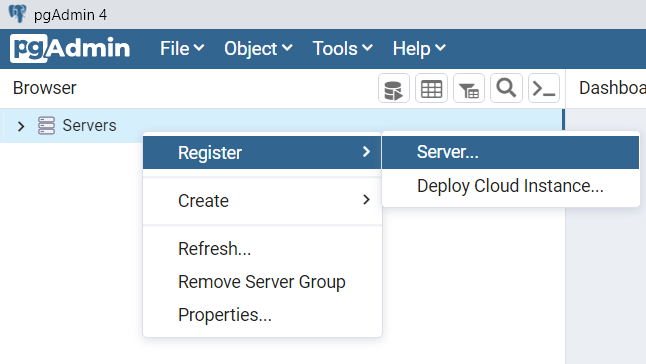
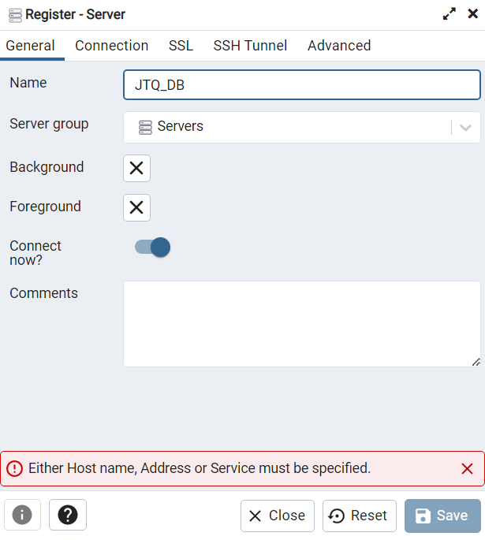
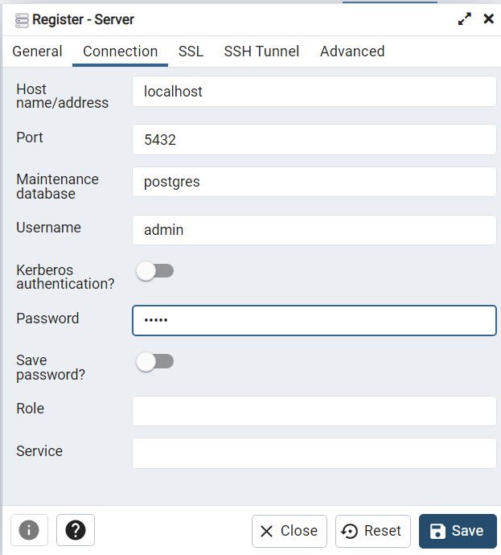
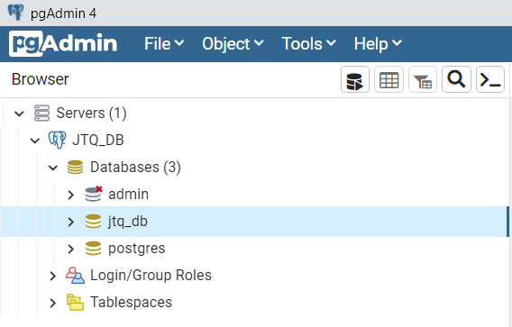

# PostgreSQL Container

Postgres has been chosen as the database manager for this project due to its reputation as one of the most advanced cross-platform and scalable Open Source systems. In addition, it offers programming interfaces for countless programming languages.

--------------
## Structure:

To use this database manager, it was chosen to virtualize it using the **docker-compose** tool, so it is based on a **docker-compose.yml** file which uses the official image of postgres version 14.2 to create the container named **jtq_postgres**, it also reads from the *postgres/init* directory to execute sql scripts at launch, and creates the admin user contained in the **config.env** file.

When launched for the first time, it creates the database **jtq_db** and the user **jtq_user** privileged in that database. This user will be used by the JTQ backend processes, Aditionally, *Visitor*, *DailyQueue* and *AccessCode* tables are created with initial data.

--------------
## Windows Installation:

In order to get it up and running, follow these steps:

### 1. Install WSL, WSL2 and Rancher Desktop:

You must open a terminak with administrator privileges and run the following commands:

~~~
wsl --install
~~~
~~~
wsl --set-default-version 2
~~~

Then proceed to install [Rancher Desktop](https://rancherdesktop.io/).

### 2. Open Rancher Desktop

### 3. Clone this repository

### 4. Launch the Docker Container

Once Rancher is started and ready, open a terminal, go to the ***PostgreSQL*** directory and run the command:

~~~
docker-compose up
~~~

*If you want to stop it, press CTRL+C and run*:

~~~
docker-compose down
~~~

### 5. Install and access pgAdmin:

Install [pgAdmin](https://www.pgadmin.org/download/pgadmin-4-windows/) from the official website.

Once opened it will ask you to set a master password to access pgAdmin, then proceed to add a *Server* in order to view tables and records of the launched database, note that both username and password is **admin** (it has been done this way only for testing).

    

        
    

 

    

        
    

    

       
    

 

    

       
    

